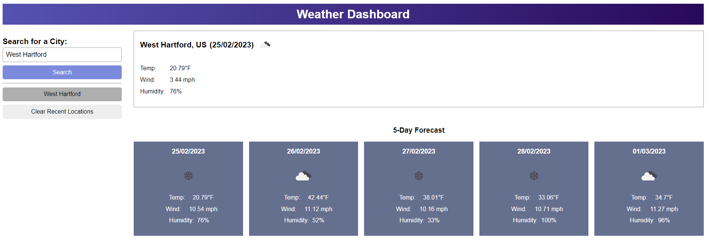

# Weather Dashboard

## Description
The weather dashboard allows anyone to type in a city or town name and get the current weather for that location including the temperature, wind speeds, and humidity. Users are also give a 5-day forecast so they can see what the weather will be like for the rest of the week.
## How it Works
- Start by typing into the search box the city or town you wish to see the weather for.
- By clicking the search button or hitting enter on the keyboard, the page will be populated with the weather for that location and the next five days.
- Any past searches will be saved and can be accessed anytime by clicking the city or town that is located underneath the search bar. 
- Any past searches can be cleared by clicking the clear recent locations button
## Website Showcase

### <ins>[Weather Dashboard](https://tiomeko.github.io/weather-dashboard/)</ins>

